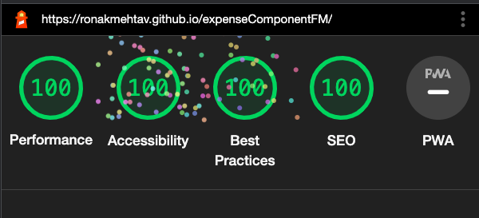

# Frontend Mentor - Expenses chart component

## The challenge

The [Frontend Mentor](https://www.frontendmentor.io) challenge is to build out this bar chart component and get it looking as close to the design as possible.

## Building your project

I have Developed this product to learn more about accesibility and also about vite and ts which I have used in this project.

1. I have found this way having double content in the html one directed towards the accessible technology and one for other And Separating this two block with class `visually-hidden` and `aria-hidden="true"`.

2. I also made change to one red color you can see the in chart block and in background-color of my balance, while testing I found it was not accessible so I changed it to accesible color which could have white font color.

### Lighthouse Score.

